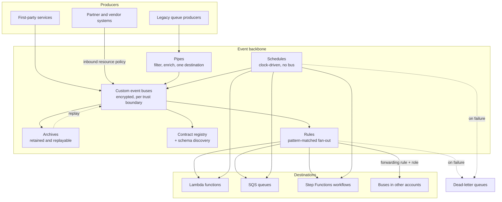
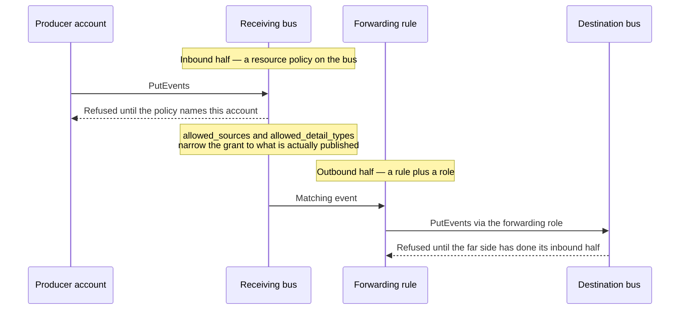

# Architecture

This configuration builds one thing: a place for events to go that neither the producer
nor the consumer owns. Everything else follows from that.

A service that calls another service knows who it is talking to, and that knowledge is the
coupling. Publishing to a bus removes it. The producer states that something happened; who
cares about it, how many of them there are, and what they do next are decisions made
elsewhere, in configuration, and changed without touching the producer. The cost is that
routing becomes a thing someone has to own — which is what this repository is.

## Component model

Read it as four surfaces that share a bus and nothing else. Rules and pipes both move
events but in opposite directions of fan; schedules touch no bus at all on the way in;
cross-account routing is an ordinary rule whose target happens to be somewhere else.

## The five surfaces

### Buses, archives, and contracts

A bus is the trust boundary. The AWS-managed `default` bus takes service events for the
whole account and cannot be given a narrow resource policy, so application traffic gets
purpose-built buses instead, each with its own retention window, its own access grants, and
its own blast radius when something goes wrong.

An **archive** is created alongside every bus unless explicitly disabled, and the reason is
timing: replay is the only way to recover from a consumer that was broken while events were
flowing, and an archive that was not configured before the incident cannot be added
afterward to cover it. Retention defaults to 90 days. Replaying re-delivers to the bus, so
every rule on it fires again — an archive can be narrowed with its own event pattern when
only part of the traffic is worth keeping.

A **contract** in `schemas/` states what a producer promises to emit. Discovery runs
alongside contracts rather than instead of them: contracts say what was agreed, discovery
reports what is actually flowing, and the gap between the two is the signal worth having.
See [the schema guide](schema-guide.md) for the format and the evolution rules.

Encryption is a customer managed key with yearly rotation, created unless one is supplied.
Its policy carries a `kms:CreateGrant` statement separate from the ordinary decrypt grant,
because archive and replay hold events beyond a single API call and need a grant rather
than a one-shot decrypt.

### Rules

A rule filters one bus and fans matching events out to targets that never learn about each
other. The part worth internalising is that **target types are authorized differently**,
and getting it wrong produces a rule that looks configured and silently never delivers:

| Target | Mechanism | Consequence |
|---|---|---|
| `lambda` | Resource policy on the function | An invoke permission naming the calling rule |
| `sqs` | Resource policy on the queue | A queue policy, opt-in because it replaces the existing one |
| `sfn` | An assumed IAM role | One role scoped to exactly the declared state machines |

Declaring a role on a Lambda or SQS target is rejected at plan time rather than accepted
and ignored, because that mistake is otherwise invisible until nothing arrives.

Failure handling has two deliberate defaults. The retry window is **one hour** against a
service default of 24, so a broken consumer reaches its dead-letter queue while the
deployment that broke it is still fresh. And there is **one queue per rule, not per
target**, because during an incident the useful question is what a route failed to deliver,
and per-target queues fragment that answer across destinations that usually fail together.
Each queue policy admits exactly one rule, so its contents never need attributing.

### Pipes

A pipe is the inverse of a rule: one source queue, one destination, with an optional
synchronous enrichment between them. It exists for the cases a rule cannot serve — a
producer that only knows how to write to SQS, a buffer that has to drain in order, a stream
that needs a lookup before anyone can act on it.

Three properties follow from it polling rather than being pushed to. It applies
**backpressure**: a slow destination means work stays in the queue instead of being retried
and dropped. It authorizes **uniformly** — one role does source, enrichment, and target,
the exact inverse of the per-target asymmetry rules carry. And it has **no dead-letter
configuration at all**: a pipe that cannot deliver simply does not delete the message, so
the source queue's own `maxReceiveCount` is the real failure path. This configuration does
not own the source queue, which is why `pipe_source_queue_arns` exists to be checked.

The filter is matched against the SQS envelope, not the event envelope, so the payload sits
under `body`. A pattern copied from a rule matches nothing and discards every message
silently; the input surface rejects `source`, `detail-type`, and `detail` as filter keys for
that reason.

### Schedules

Some work happens at a time rather than because something happened. EventBridge accepts a
schedule expression only on the AWS-managed default bus, so a scheduled rule cannot live on
any bus declared here — schedules are their own surface, belonging to no bus, with nothing
stored and no replay. A missed run is simply gone.

That absence drives the two decisions worth making deliberately. A timezone is named rather
than an offset baked in, so a schedule still runs at its local time after the clocks change.
And a flexible time window spreads a fleet of schedules that would otherwise all fire in the
same second — left unset only when the job must run exactly on the hour.

### Cross-account routing

Cross-account delivery is two independent halves, usually owned by two different teams, and
almost every failure is doing one and assuming the other:

The refusal on the outbound half is invisible without a dead-letter queue, which is why
`cross_account_forwarding_without_dead_letter_queue` reports any route lacking one and why a
new route is worth shipping disabled and enabled once the far side is confirmed.

Two properties to design around. The receiving bus sees the **sending** account's id in the
`account` field while `source` and `detail-type` survive unchanged, so a consumer that needs
the origin should read `account`. And a single hop is the pattern to aim for: a cycle
between two buses sustains itself and bills on every pass. Forwarding to a bus this
configuration creates is rejected outright; a longer cycle is a review question rather than
a machine-checkable one.

## Design decisions

**Configuration, not code.** Buses, retention, routing, and schedules are declared data.
Adding a consumer is a change to a map in this repository, never a change inside a producing
service. The whole point of the backbone is lost the moment routing lives in application
code.

**Fail at plan time.** Inputs carry validation and resources carry preconditions, so a
malformed pattern, an impossible combination, or a target authorized the wrong way is
rejected before anything is created. The alternative is an error at apply — or worse,
silence.

**The silent failure gets a test, not a comment.** An event pattern is the one part of this
configuration that fails invisibly: a wrong pattern is created successfully, keeps its
targets, reports healthy, and never matches. Terraform can confirm it parses as JSON and
nothing further, so `tests/` reimplements the matching semantics, the structural rules the
service enforces, and the conventions this repository adds — and checks every documented
example against the published contracts on that basis.

**Encrypt by default, and record the exception where it lives.** Buses use a customer
managed key. Archives currently do not, because the provider attribute that would set one
arrived in a major version above the pinned ceiling; the constraint and the version that
lifts it are recorded at the archive declaration rather than left to be rediscovered.

**Authorize precisely.** Every delivery grant names the one rule it exists for. Every
invocation role names the exact destinations it may reach, and a role for a pipe or a
schedule grows a statement only when something in the configuration actually needs it.

**Make the live surface visible.** A pipe draining a queue unfiltered, a target with nowhere
to send a failure, a forwarding route without a dead-letter queue: each is reported as an
output rather than left to be discovered during an incident.

**One clock, one owner.** Recurring work is declared here alongside the routing it triggers,
so a schedule, its permissions, and its failure path are reviewed together rather than
living in whatever service happened to own a cron entry.

**Placeholders only.** Every account identifier, ARN, and domain name in this repository is
a documentation example. Nothing here is applied against an account by the repository
itself.
